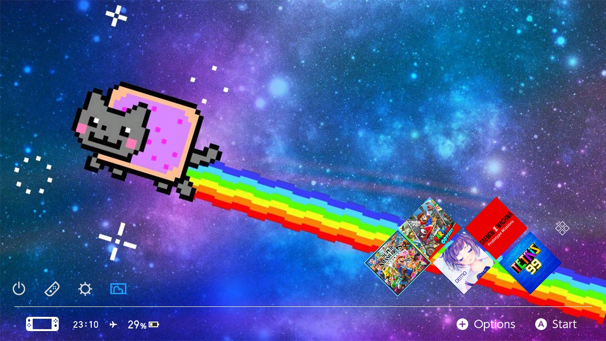

# Switch theme injector
[](https://discord.gg/rqU5Tf8)
[](https://github.com/exelix11/SwitchThemeInjector/releases)
[](https://github.com/exelix11/SwitchThemeInjector/releases)
[](https://ko-fi.com/exelix11)



This repo contains tools to create and install custom themes for the home menu "qlaunch" of the nintendo switch. You will need a modded console with the atmosphere CFW.

These tools are:
- NXThemes installer: Homebrew app that runs on the switch itself and can be used to install and manage themes.
- Switch theme injector: The windows application to create and edit custom themes
- [Switch theme injector online](http://exelix11.github.io/SwitchThemeInjector/v2) (also called WebInjector): A port of the windows injector as a web app, it lacks some features like custom applet icons and common.szs layouts support.

You can download the binaries from the [releases tab](https://github.com/exelix11/SwitchThemeInjector/releases).

Since the console OS doesn't implement custom themes natively this tool patches the system layout files stored in the SZS in the romfs of qlaunch.

SZS files extracted from the console are considered copyrighted data and can't be shared online that's why the **nxtheme format** has been developed, it contains only differential info and can be freely shared. Unless you're dealing with making your own patches and custom layouts you should only use nxtheme files.

# Getting started
To use custom themes you need as hacked switch that's at least on firmware 5.0

You can find some themes on the [themezer website](https://themezer.net/)

## Installing themes
This is the most common scenario, you just need the theme installer homebrew. 

Make a folder called `themes` in the root of your sd card and copy your themes in either nxtheme or szs format in it. Then launch the theme installer and you should be able to select and install them.

Reboot and your theme should be applied.

Note that each file is a single home menu part (eg just the lockscreen or just the main menu), a full home menu theme is composed by multiple nxtheme files.

**To remove a theme** just select uninstall in the theme installer. You can just install a different theme to overwrite the currently installed one.

When a new firmware comes out **before upgrading (or downgrading) remember to uninstall any theme you have installed** to avoid compatibility issues, if you forget your console may not boot untill the theme is removed as explained next. 

**In case your console doesn't boot anymore due to a bad theme** (mostly with szs themes) delete the `\atmosphere\contents\01000000001000` folder from your sd (it's `\<cfw name>\titles\01000000001000` for old atmosphere and other CFWs), now your console should be booting, launch the theme installer and select uninstall theme to finish the cleanup process.

## Making themes
To make themes you need either the Theme injector application or the web version.

### Creating a nxtheme file
Open the injector and go to the NXThemes builder tab, open any **720p JPG image** (1280x720 pixels), select a custom layout and click on build nxtheme.

For making themes you can only use JPG images or DXT1-encoded DDS images. For best quality it's better to manually encode the image to DDS so you can have a preview of how will it look like with the compression applied. 

### Linux Support
The GUI only works on windows, on linux you can use the CLI through mono, you will need the `mono-complete` package.\
Then you should be able to launch the app by running `mono SwitchThemes.exe help`.

### Command line usage (CLI)
#### Building nxthemes
```
SwitchThemes.exe buildNX home "<your image.png/jpg/dds>" "<json layout file, optional>" "name=<theme name>" "author=<author name>"  "out=<OutputPath>.nxtheme"
```
this will build a theme for the home menu, instead of `home` you can use: `lock` for lockscreen, `apps` for the all apps screen, `set` for the settings applet, `user` for the user page applet and `news` for the news applet. Only the image and out file args are needed. \
Other options specific to the theme target such as applet icons are availbale as well, run `SwitchThemes.exe help` for more info

#### Remote install
Launch the theme installer and select remote install, then run the following command:
```
SwitchThemes.exe install 192.168.X.Y "<nxtheme/szs file>"
```
Where `192.168.X.Y` is your console IP address.

# Custom layouts
Custom layouts are JSON files that allow changing the appearence of the home menu by moving the UI components. \
To create a custom layout you will need the original home menu szs files found in `/themes/systemData` on your sd (if you ever used the theme installer) and a tool capable of editing them like the [switch layout editor](https://github.com/FuryBaguette/SwitchLayoutEditor).

[Here](https://github.com/exelix11/SwitchThemeInjector/blob/master/CustomLayouts.md) you can find more info about layouts and the supported properties.

For layout editing read the [Layout editor wiki](https://github.com/FuryBaguette/SwitchLayoutEditor/wiki) to get started, parts of the main home menu layout are documented in this repo [wiki](https://github.com/exelix11/SwitchThemeInjector/wiki/ResidentMenu.szs).
