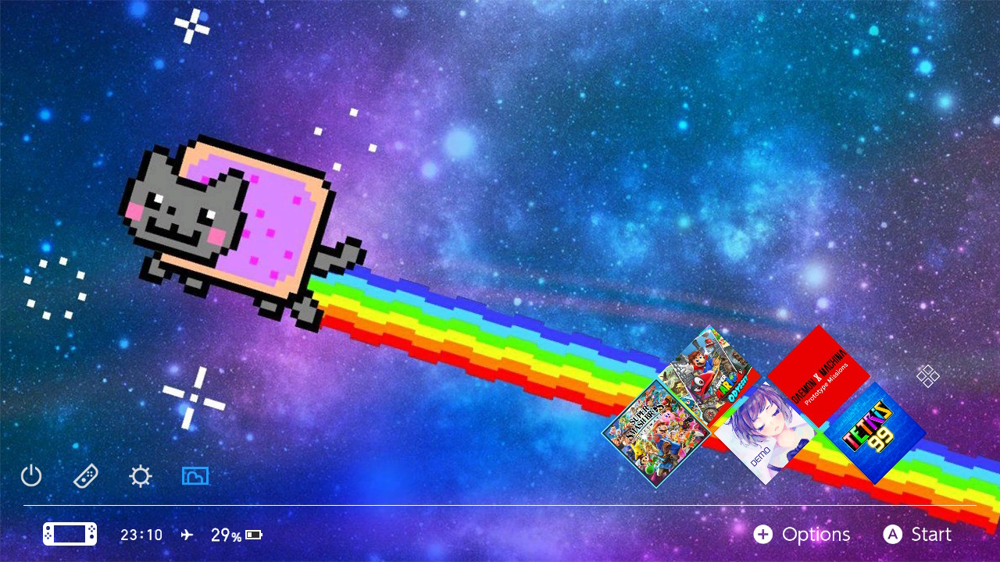

# Switch theme injector

This repo contains tools to create and install custom themes for the home menu "qlaunch" of the nintendo switch. You will need a modded console with the atmosphere CFW.

To install themes download **NXThemes installer** from the [releases page](https://github.com/exelix11/SwitchThemeInjector/releases) and run it on your console, to create themes you can use the tools provided by [themezer.net](themezer.net) or the standalone [online theme creator](https://themezernx.github.io/nxtheme-editor/).

Since the console OS doesn't implement custom themes natively this tool patches the system layout files stored in the SZS in the romfs of qlaunch.

SZS files extracted from the console are considered copyrighted data and can't be shared online that's why the **nxtheme format** has been developed, it contains only differential info and can be freely shared. Unless you're dealing with making your own patches and custom layouts you should only use nxtheme files.

# Getting started
To use custom themes you need as hacked switch on a recent firmware.

You can find some themes on the [themezer website](https://themezer.net/)

## Installing themes
This is the most common scenario, you just need the theme installer homebrew. 

Make a folder called `themes` in the root of your sd card and copy your themes, accepted formats are `.nxtheme`, `.szs`, `.jpg` and `.png`. Launch the theme installer and select the theme you want to install.

Reboot your console and your theme should be applied.

Note that each file is a single home menu part (eg just the lockscreen or just the main menu), a full home menu theme is composed by multiple nxtheme files.

**Layout modifications**: Some themes may alter the UI layout of the home menu via custom layouts. These can be version specific and may look broken on different firmware versions, if you find a theme that doesn't look right it probably needs to be updated by the author. Themezer maintains a number of common layouts for all firmware versions.

## Uninstalling themes
Themes live only on the SD card. To remove installed themes, select uninstall in the theme installer. You can also install a different theme to overwrite the currently installed one.

## Crashes on boot
If you install a bad theme or update your firmware without removing the current theme your console may crash on boot, to fix this you need to delete the `\atmosphere\contents\01000000001000` folder from your sd scard.

Starting with version 2.9 the theme installer provides an **update detection sysmodule** that automatically uninstall themes when the firmware is updated, you can install it from the settings page of the theme installer.

# Custom layouts
Custom layouts are JSON files that allow changing the appearance of the home menu by moving the UI components. \
To create a custom layout you will need the original home menu szs files found in `/themes/systemData` on your sd (if you ever used the theme installer) and a tool capable of editing them like the [switch layout editor](https://github.com/FuryBaguette/SwitchLayoutEditor).

[Here](https://github.com/exelix11/SwitchThemeInjector/blob/master/CustomLayouts.md) you can find more info about layouts and the supported properties.

For layout editing read the [Layout editor wiki](https://github.com/FuryBaguette/SwitchLayoutEditor/wiki) to get started, parts of the main home menu layout are documented in this repo [wiki](https://github.com/exelix11/SwitchThemeInjector/wiki/ResidentMenu.szs).

# Additional projects

This repository also provides NXThemeTool which is a PC command line application to create and edit nxtheme files, it also supports the remote install feature of the theme installer. You can run it on any OS with .NET 8 installed.

The following tools previously provided by this reporsitory have been deprecated:
- Switch theme injector: was the original Windows-only theme creator application, it has been replaced by the online theme creator and NXThemeTool. The source code can be found in the history of this repo and previous releases are still available.
- [Switch theme injector online](http://exelix11.github.io/SwitchThemeInjector/v2) (also called WebInjector): it was an early port of the theme injector to the web, the old links still work but the project is no longer maintained and has been replaced by the themezer online theme creator.